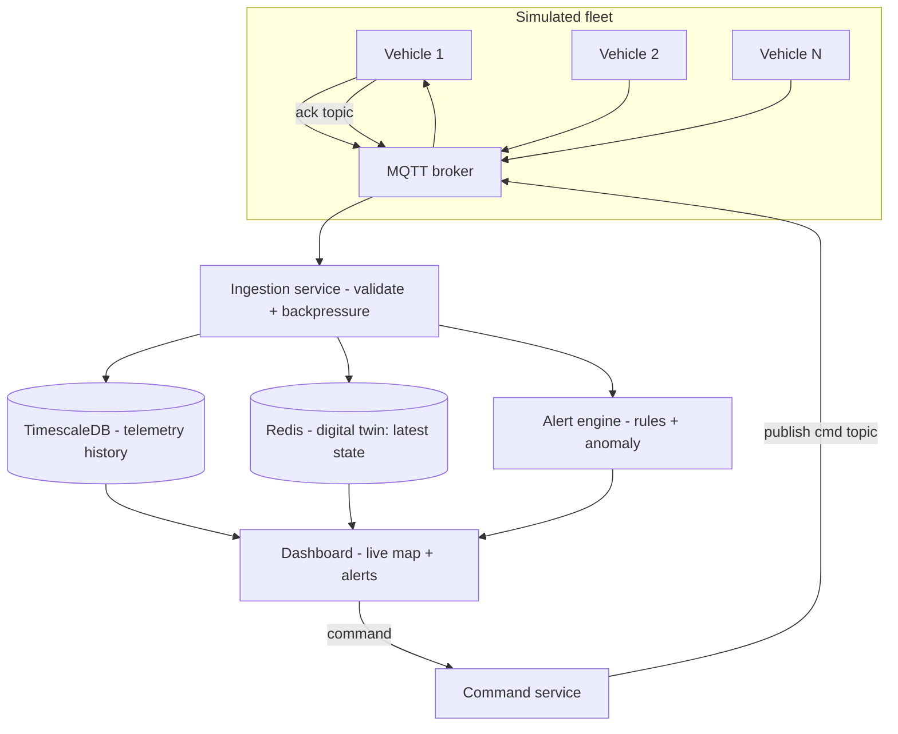

# P4 — SwarmControl: mission control for a simulated drone / rover swarm

> Reuses your production-monitoring experience (Grafana/Kibana/alerting) in an IoT fleet form.

## 1. What it is

SwarmControl is a mission-control center for a swarm of hundreds-to-thousands of **simulated** drones or Mars rovers exploring a virtual map. Each vehicle streams telemetry (position, heading, battery, speed, sensor readings) many times per second. Operators watch a live map, receive **alerts** when a vehicle strays out of bounds, runs low on battery, or reports anomalous readings, and can send **commands** ("return to base," "reroute," "set geofence") that the vehicle **acknowledges**.

No hardware required — the vehicles are simulated processes. But the platform is a real, at-scale **IoT fleet telemetry system**: high-throughput ingestion, time-series storage, per-device digital twins, a bidirectional command channel, and streaming alerting — the core of what Samsara / Tesla fleet / Caterpillar telematics software does.

## 2. What you'll demonstrate

- **High-throughput ingestion** over MQTT with schema validation and backpressure.
- **Time-series data engineering** — storage, downsampling, retention, fast range queries.
- **Digital twin** modeling — current + historical state per device.
- **Bidirectional command/ack** with delivery guarantees.
- **Streaming alerting** — rules + simple anomaly detection on live data.
- **Observability** — the dashboards/metrics story from your Paytm monitoring work.

## 3. Tech stack (and why)

- **MQTT broker** (Mosquitto or EMQX) — the standard IoT protocol; pub/sub with QoS levels is exactly how real fleets report.
- **Vehicle simulators** in **Python** — easy to spawn thousands with realistic motion + fault injection.
- **Ingestion service** in **Go** or **Java** — subscribes to MQTT, validates, writes to the time-series DB; must handle backpressure.
- **TimescaleDB** (Postgres extension) or **InfluxDB** — purpose-built time-series storage with downsampling/retention. Timescale lets you reuse SQL/Postgres skills.
- **Redis** — hot per-vehicle "current state" (the digital twin cache) + command queues.
- **React + Leaflet/Mapbox** (or Grafana geomap) — the live map dashboard.
- **Docker Compose** to run broker + DB + services + a fleet of simulators.

## 4. Architecture



## 5. Data model / topics

**MQTT topics:**
- `fleet/{vehicleId}/telemetry` (vehicle -> server, QoS 0/1)
- `fleet/{vehicleId}/cmd` (server -> vehicle, QoS 1)
- `fleet/{vehicleId}/ack` (vehicle -> server)

**Telemetry message:** `{ vehicleId, ts, lat, lon, headingDeg, speed, batteryPct, temp, status }`.

**TimescaleDB hypertable:**
```sql
CREATE TABLE telemetry (
  vehicle_id TEXT NOT NULL,
  ts         TIMESTAMPTZ NOT NULL,
  lat        DOUBLE PRECISION, lon DOUBLE PRECISION,
  heading    REAL, speed REAL, battery_pct REAL, temp REAL, status TEXT
);
SELECT create_hypertable('telemetry', 'ts');
-- continuous aggregate for 1-minute downsampling + a retention policy
```

**Digital twin (Redis hash):** `twin:{vehicleId}` -> latest fields + `lastSeen`.

## 6. Implementation plan (milestones)

**M1 — One vehicle end-to-end.** A Python simulator publishes telemetry over MQTT; the ingestion service subscribes and writes to TimescaleDB; a basic dashboard plots one vehicle on a map.

**M2 — Scale the fleet + backpressure.** Spawn hundreds/thousands of simulators (each a moving, battery-draining vehicle). Add batched inserts, a bounded queue, and backpressure handling in the ingestion service so it degrades gracefully instead of falling over. Measure msgs/sec.

**M3 — Digital twin + history queries.** Maintain `twin:{vehicleId}` in Redis for O(1) "current state." Add API endpoints: current fleet snapshot, and "last 24h for vehicle X" (served from TimescaleDB continuous aggregates for speed).

**M4 — Command channel with acks.** Dashboard can send a command to a vehicle (`reroute`, `RTB`, `set-geofence`). Publish to the cmd topic (QoS 1); the simulator applies it and publishes an ack. Track command state (sent -> acked -> applied) and surface undelivered commands.

**M5 — Streaming alerts.** Alert engine evaluates rules on the live stream: geofence breach (point-in-polygon), low battery, lost-comms (no telemetry for T seconds), and a simple statistical anomaly (e.g., temp > rolling mean + k·stddev). Fire alerts to the dashboard; measure event-to-alert latency.

**M6 — Dashboard polish + load.** Live map with vehicle markers, trails, alert overlays; a fleet health panel. Load-test to find sustainable throughput and report ingest p95.

## 7. The hard parts, explained

- **Backpressure:** thousands of devices at high frequency will outrun naive single-row inserts. Batch writes, use a bounded channel/queue, and shed or buffer under overload — and be able to explain the trade-off (drop vs. delay).
- **Time-series scale:** raw data grows fast. Continuous aggregates (pre-downsampled rollups) make dashboards fast and retention policies keep storage bounded.
- **Lost-comms detection** is a "negative event" — you're alerting on the *absence* of data, which needs a timer/sweep per vehicle, not a stream trigger.
- **Geofencing** is a point-in-polygon test per telemetry point; keep it cheap (bounding-box pre-check) at fleet scale.
- **Command delivery** to an offline vehicle: decide whether commands queue until reconnect (QoS 1 + broker persistence) or expire.

## 8. Testing & correctness

- **Simulator determinism:** seed the RNG so runs are reproducible.
- **Ingestion tests:** malformed messages rejected; batching correctness; backpressure under a burst.
- **Alert tests:** craft telemetry that crosses a geofence / drains battery / goes silent and assert the right alert fires within the latency budget.
- **Command/ack tests:** command marked delivered only after ack; undelivered command surfaced after timeout.
- **Load test:** ramp to N vehicles; verify no data loss up to the target rate and graceful degradation beyond it.

## 9. Benchmarking & metrics

- **Ingest throughput** (msgs/sec) from N simulated vehicles + **ingest p95** latency.
- **"Last 24h for vehicle X" query latency** (raw vs. continuous-aggregate).
- **Event-to-alert latency** (e.g., geofence breach detected in under Y ms/s).
- **Command round-trip** (send -> ack) latency.

## 10. How to run

```bash
docker compose up -d                 # mqtt broker, timescaledb, redis
go run ./ingestion                   # or ./gradlew bootRun
python sim/spawn.py --vehicles 2000  # spin up the swarm
npm --prefix dashboard run dev
```

## 11. Suggested repo structure

```
swarmcontrol/
  ingestion/          # MQTT subscriber, validation, batched writes, backpressure
  command/            # command service + ack tracking
  alerts/             # rule + anomaly engine (geofence, battery, lost-comms)
  api/                # fleet snapshot + history endpoints
  sim/                # Python vehicle simulators + spawner
  dashboard/          # React + Leaflet live map
  db/                 # Timescale schema, continuous aggregates, retention
  docker-compose.yml
  README.md
```

## 12. Stretch goals

- **OTA update simulation** — roll a firmware version across the fleet in waves with health checks and rollback.
- **ROS2 + basic SLAM** variant for a single "hero" rover (deeper robotics angle for Neuralink/Nuro/Contoro).
- **Predictive maintenance** — a small model flags vehicles likely to fail from telemetry trends.

## Resume bullets (tune with your real numbers)

- Built **SwarmControl**, a fleet mission-control platform (**MQTT**, **Go**, **TimescaleDB**, **React/Leaflet**) ingesting **50K+ msgs/sec** from thousands of simulated vehicles with schema validation and backpressure at **ingest p95 under X ms**.
- Implemented per-vehicle **digital twins** with a bidirectional **command/ack** channel and streaming **geofence/battery/anomaly alerting**, cutting event-to-alert latency to **under Y s**.
