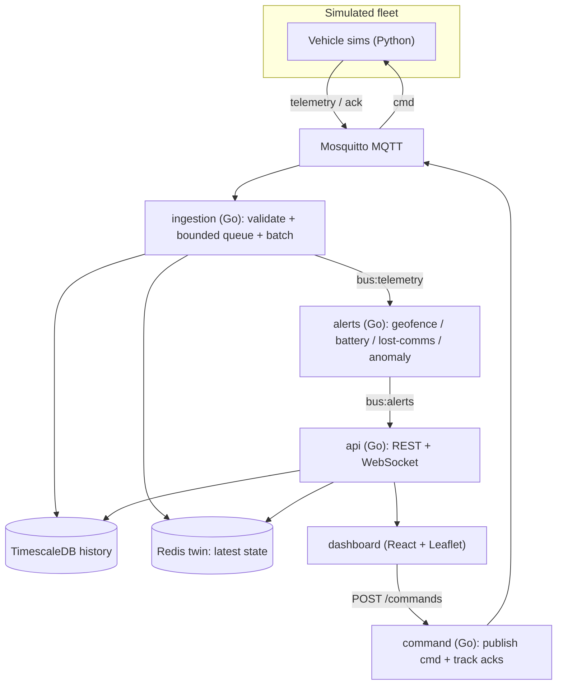

# SwarmControl

Mission control for a swarm of **simulated** drones / rovers. SwarmControl is a
real, at-scale IoT fleet telemetry platform — high-throughput MQTT ingestion,
time-series storage, per-device digital twins, a bidirectional command/ack
channel, and streaming alerting — driven entirely by simulated vehicles (no
hardware required).

This repository implements the design in
[P4-SwarmControl.md](P4-SwarmControl.md).

## Architecture



### Components

| Path          | Language           | Responsibility                                                            |
| ------------- | ------------------ | ------------------------------------------------------------------------- |
| `sim/`        | Python             | Seedable vehicle simulators + spawner with fault injection                |
| `ingestion/`  | Go                 | MQTT subscribe -> validate -> batched/backpressured Timescale writes -> twin + fan-out |
| `alerts/`     | Go                 | Streaming rules: geofence, low battery, lost-comms, anomaly               |
| `command/`    | Go                 | Send commands (QoS 1), track sent -> acked -> applied, flag undelivered   |
| `api/`        | Go                 | Fleet snapshot, history queries, command proxy, live WebSocket            |
| `dashboard/`  | React + Leaflet    | Live map, trails, fleet health, alerts, command controls                  |
| `db/`         | SQL                | Timescale hypertable, 1-minute continuous aggregate, retention, `command_log` |
| `internal/`   | Go                 | Shared packages (telemetry, store, twin, bus, alertengine, command, metrics) |

## Quick start (Docker Compose)

Brings up the broker, TimescaleDB, Redis, all backend services, the dashboard,
and a fleet of 200 simulated vehicles:

```bash
docker compose up -d --build
# Dashboard:        http://localhost:8080
# API:              http://localhost:8081/api/fleet
# Command service:  http://localhost:8082/commands
# Ingestion metrics http://localhost:9101/metrics
# Alert metrics     http://localhost:9102/metrics
```

Scale the swarm:

```bash
docker compose run --rm -e SIM_VEHICLES=2000 -e SIM_RATE_HZ=2 sim
```

## Run locally (without Docker)

Start the infra (broker + TimescaleDB + Redis) however you like, apply
[`db/schema.sql`](db/schema.sql), then:

```bash
# backend services (separate shells)
go run ./ingestion
go run ./alerts
go run ./command
go run ./api

# simulated fleet
python -m venv .venv && . .venv/bin/activate
pip install -r sim/requirements.txt
python sim/spawn.py --vehicles 2000 --rate 1 --broker localhost:1883

# dashboard
npm --prefix dashboard install
npm --prefix dashboard run dev   # http://localhost:5173
```

All services read configuration from environment variables (see
[`internal/config/config.go`](internal/config/config.go)); the defaults target
`localhost`.

## MQTT topics & data model

- `fleet/{vehicleId}/telemetry` — vehicle -> server (`{ vehicleId, ts, lat, lon, headingDeg, speed, batteryPct, temp, status }`)
- `fleet/{vehicleId}/cmd` — server -> vehicle (QoS 1), `{ id, type, payload }`
- `fleet/{vehicleId}/ack` — vehicle -> server, `{ id, vehicleId, state }`

Digital twin lives in Redis at `twin:{vehicleId}`; the alert engine and API
communicate over Redis pub/sub (`bus:telemetry`, `bus:alerts`).

## API

| Method | Path                                            | Description                                             |
| ------ | ----------------------------------------------- | ------------------------------------------------------- |
| GET    | `/api/fleet`                                    | Current twin snapshot for every vehicle                 |
| GET    | `/api/vehicles/{id}/history?window=24h&resolution=1m` | History from the continuous aggregate (`resolution=raw` for raw) |
| GET    | `/api/alerts`                                   | Recent alerts (capped list)                             |
| POST   | `/api/commands`                                 | Proxy to the command service (`{vehicleId,type,payload}`) |
| WS     | `/ws`                                           | Coalesced fleet snapshots + live alerts                 |

## Alerting rules

- **Geofence breach** — point-in-polygon with a bounding-box pre-check
  ([`internal/alertengine/geofence.go`](internal/alertengine/geofence.go)).
- **Low battery** — battery `<=` threshold (default 15%).
- **Lost-comms** — no telemetry for T seconds, detected by a timer sweep on the
  *absence* of data ([`internal/alertengine/engine.go`](internal/alertengine/engine.go)).
- **Anomaly** — temperature `>` rolling mean + k·stddev
  ([`internal/alertengine/anomaly.go`](internal/alertengine/anomaly.go)).

Alerts are edge-triggered (fire on transition into the alert state) to avoid
per-message spam.

## Backpressure

The ingestion writer ([`internal/store/store.go`](internal/store/store.go))
sits behind a **bounded channel** and flushes **batched `COPY` inserts** on
size or timeout. Under overload it either **sheds** (drop, default) or
**delays** (block) — controlled by `INGEST_DROP_ON_FULL` — and exposes queue
depth, drops, and insert latency as metrics.

## Benchmarking & metrics

Prometheus-format metrics are exposed by ingestion (`:9101/metrics`) and alerts
(`:9102/metrics`):

| Metric                        | Meaning                                        |
| ----------------------------- | ---------------------------------------------- |
| `ingest_messages_total`       | Accepted telemetry messages (throughput basis) |
| `ingest_dropped_total`        | Messages shed under backpressure               |
| `ingest_queue_depth`          | Current bounded-queue occupancy                |
| `ingest_insert_latency_ms`    | Batched insert latency p50/p95/p99             |
| `ingest_invalid_total`        | Rejected (malformed/out-of-range) messages     |
| `alerts_fired_total`          | Alerts fired                                   |
| `alert_event_to_alert_ms`     | Event-to-alert latency p50/p95/p99             |

Sample derivations:

- **Ingest throughput** = delta `ingest_messages_total` / interval.
- **Ingest p95** = `ingest_insert_latency_ms{quantile="0.95"}`.
- **History query latency** = the `queryMs` field on `/api/vehicles/{id}/history`
  (compare `resolution=raw` vs `1m`).
- **Event-to-alert latency** = `alert_event_to_alert_ms`.
- **Command round-trip** = `sentAt` -> `ackedAt` on a command record.

## Testing

```bash
go test ./...                          # Go unit tests
python -m unittest discover -s sim     # simulator determinism + fault tests
npm --prefix dashboard run build       # dashboard type-check + build
```

Covered: telemetry validation, bounded-queue backpressure, geofence
point-in-polygon, anomaly detection, lost-comms sweep, command state machine,
and simulator determinism/fault behaviour.

## Milestones

M1 one-vehicle end-to-end · M2 fleet scale + backpressure · M3 digital twin +
history · M4 command/ack · M5 streaming alerts · M6 dashboard + load — all
implemented; see [P4-SwarmControl.md](P4-SwarmControl.md) section 6.
