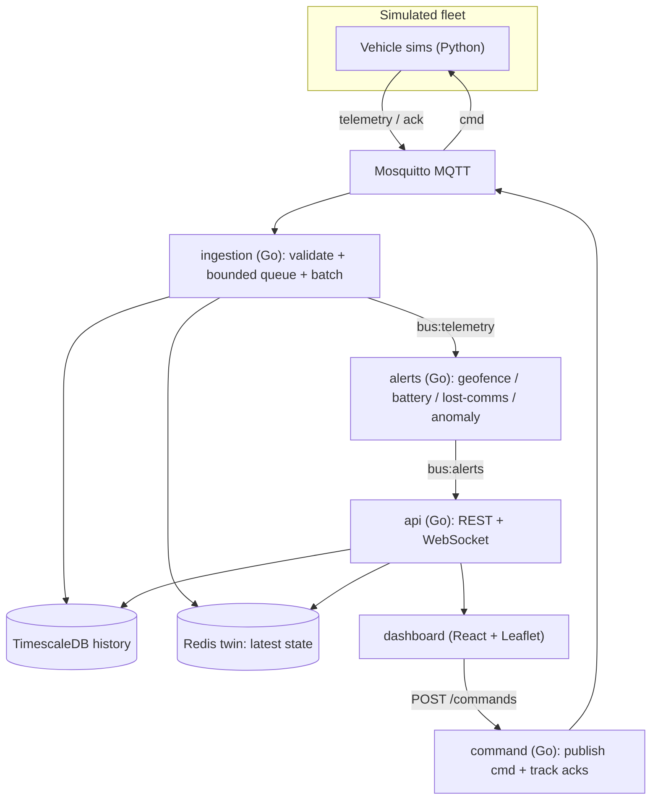

# SwarmControl

[](https://github.com/RakMan09/swarm-control/actions/workflows/ci.yml)
[](https://github.com/RakMan09/swarm-control/actions/workflows/pages.yml)

**Mission control for a swarm of simulated drones and rovers.**

**▶ Live demo (no install): https://rakman09.github.io/swarm-control/** — a fully
interactive, browser-only build where an in-page simulator drives the same live
map, alerts, and commands (see [Live demo](#live-demo) for how it's wired).

SwarmControl is a full-stack IoT fleet telemetry platform. Hundreds to thousands
of simulated vehicles roam a virtual map, each streaming live telemetry
(position, heading, speed, battery, temperature) many times per second. A web
dashboard shows the whole fleet moving in real time, raises alerts when a vehicle
misbehaves, and lets an operator send commands that the vehicle acknowledges.

No hardware is required — the vehicles are software processes — but everything
behind them is a real, at-scale system: high-throughput MQTT ingestion,
time-series storage, per-device digital twins, a bidirectional command/ack
channel, and streaming alerting. It's the same shape as the software behind
real fleet-telematics products (think Samsara, Tesla fleet, Caterpillar
telematics).

This repository implements the design in
[P4-SwarmControl.md](P4-SwarmControl.md).

---

## What you can do with it

- **Watch a live fleet** — see every vehicle move on a map with heading, trails,
  and status, updating continuously.
- **Get alerted automatically** — the platform flags vehicles that leave a
  geofence, run low on battery, go silent, or report anomalous sensor readings.
- **Send commands** — tell a vehicle to return to base, reroute, or accept a new
  geofence, and watch it acknowledge and comply.
- **Query history** — pull the last minutes/hours/day of a vehicle's track from
  time-series storage.
- **Scale it up** — spin up thousands of vehicles and observe throughput,
  latency, and how the system handles overload.

---

## The site (web dashboard)

The **dashboard is the face of the project** — a single-page web app that turns
the raw telemetry stream into a live operations console. It's built with React,
TypeScript, and Leaflet, and talks to the backend over REST + a WebSocket.

When you open it you get a mission-control view:

- **Live fleet map (left).** Every vehicle is a dot on a dark map, colored by
  status (active, returning, low battery) and turning red when it has an active
  alert. Vehicles leave short **trails** so you can see where they've been. Click
  a vehicle for a popup with its battery, speed, temperature, and heading. A
  legend explains the colors.
- **Fleet-health panel (top right).** At-a-glance counters — total vehicles,
  active, returning, low-battery, stale (not recently heard from), and current
  alert count — plus the fleet's average battery level.
- **Command bar (right).** Pick a vehicle (or click it on the map) and send
  **Return to base**, **Reroute**, or **Set geofence**. Commands go out over
  MQTT and are confirmed by the vehicle's acknowledgement; a toast confirms it
  was sent.
- **Alerts feed (bottom right).** A live, color-coded list of recent alerts
  (critical / warning / info) with the vehicle, alert type, and how long ago it
  fired. Click an alert to select that vehicle on the map.
- **Connection indicator (top bar).** Shows the live vehicle count and whether
  the WebSocket is `LIVE` or `RECONNECTING` (it auto-reconnects).

Updates arrive over a WebSocket. To keep the browser smooth no matter how fast
telemetry is flowing, the server pushes a **coalesced fleet snapshot a few times
per second** rather than one message per vehicle per tick, while **alerts are
pushed the instant they fire**.

### Where to open it

- **Live demo (hosted, zero install):** https://rakman09.github.io/swarm-control/
- **Docker Compose (full real stack):** http://localhost:8080
- **Local dev server:** http://localhost:5173

> Note: this is a simulation-driven demo — the fleet is generated by the vehicle
> simulators, not real hardware. That's by design; the goal is to exercise the
> full telemetry platform end to end.

### Live demo

The hosted link runs the dashboard in **demo mode**: an in-browser simulator
([`dashboard/src/demo/engine.ts`](dashboard/src/demo/engine.ts)) generates a
moving fleet, trips the same alert rules (geofence, low battery, lost-comms,
anomaly), and applies commands with an ack — all with **no backend**, so anyone
can click the link and immediately see the console working. The UI is identical
to the full-stack version; only the data source differs (see
[`dashboard/src/datasource.ts`](dashboard/src/datasource.ts)).

It is published automatically by the
[Pages workflow](.github/workflows/pages.yml) on every push to `main`. To enable
it on a fork: **Settings -> Pages -> Source: GitHub Actions**. The full,
backend-driven experience is the Docker Compose stack below.

---

## Key features

| Area | What it does |
| ---- | ------------ |
| High-throughput ingestion | Subscribes to MQTT, validates every message against a schema, and writes to TimescaleDB with **batched inserts + backpressure**. |
| Time-series storage | TimescaleDB hypertable with a **1-minute continuous aggregate** (fast history) and a **retention policy** (bounded storage). |
| Digital twin | Redis holds each vehicle's latest state (`twin:{id}`) for O(1) "current state" reads. |
| Command / ack channel | Commands published at **QoS 1**; lifecycle tracked `sent -> acked -> applied`, with undelivered commands flagged after a timeout. |
| Streaming alerts | Geofence breach, low battery, lost-comms (absence of data), and statistical anomaly detection on the live stream. |
| Observability | Prometheus-format metrics for throughput, ingest latency, and event-to-alert latency. |
| Realistic simulators | Seedable (reproducible) vehicle motion + battery model with fault injection. |

---

## How it works



1. **Simulators** publish telemetry to the **MQTT broker** and listen for commands.
2. **Ingestion** validates each message, batches it into **TimescaleDB**, updates
   the **Redis** digital twin, and republishes it on an internal bus.
3. The **alert engine** evaluates rules on that live stream and publishes alerts.
4. The **API** serves the dashboard: current fleet state (from Redis), history
   (from TimescaleDB), recent alerts, and a live WebSocket feed.
5. Operator **commands** flow from the dashboard through the command service,
   out over MQTT to the vehicle, which **acknowledges** back.

### Tech stack

- **MQTT broker:** Eclipse Mosquitto (the standard IoT pub/sub protocol).
- **Backend services:** Go (ingestion, alerts, command, api).
- **Time-series database:** TimescaleDB (PostgreSQL extension).
- **Hot state / bus:** Redis (digital twin + pub/sub).
- **Simulators:** Python.
- **Dashboard:** React + TypeScript + Vite + Leaflet.
- **Orchestration:** Docker Compose.

### Repository layout

| Path | Language | Responsibility |
| ---- | -------- | -------------- |
| `sim/` | Python | Seedable vehicle simulators + spawner with fault injection |
| `ingestion/` | Go | MQTT subscribe -> validate -> batched/backpressured Timescale writes -> twin + fan-out |
| `alerts/` | Go | Streaming rules: geofence, low battery, lost-comms, anomaly |
| `command/` | Go | Send commands (QoS 1), track sent -> acked -> applied, flag undelivered |
| `api/` | Go | Fleet snapshot, history queries, command proxy, live WebSocket |
| `dashboard/` | React + Leaflet | Live map, trails, fleet health, alerts, command controls |
| `db/` | SQL | Timescale hypertable, 1-minute continuous aggregate, retention, `command_log` |
| `internal/` | Go | Shared packages (telemetry, store, twin, bus, alertengine, command, metrics) |

---

## Getting started

### Option 1 — Docker Compose (everything at once)

Brings up the broker, TimescaleDB, Redis, all backend services, the dashboard,
and a fleet of 200 simulated vehicles:

```bash
docker compose up -d --build
```

Then open the dashboard and endpoints:

```
Dashboard:          http://localhost:8080
API (fleet):        http://localhost:8081/api/fleet
Command service:    http://localhost:8082/commands
Ingestion metrics:  http://localhost:9101/metrics
Alert metrics:      http://localhost:9102/metrics
```

Scale the swarm up:

```bash
docker compose run --rm -e SIM_VEHICLES=2000 -e SIM_RATE_HZ=2 sim
```

### Option 2 — Run locally (without Docker)

Start the infra (broker + TimescaleDB + Redis) however you like, apply
[`db/schema.sql`](db/schema.sql), then:

```bash
# backend services (separate shells)
go run ./ingestion
go run ./alerts
go run ./command
go run ./api

# simulated fleet
python -m venv .venv && . .venv/bin/activate
pip install -r sim/requirements.txt
python sim/spawn.py --vehicles 2000 --rate 1 --broker localhost:1883

# dashboard
npm --prefix dashboard install
npm --prefix dashboard run dev   # http://localhost:5173
```

All services read configuration from environment variables (see
[`internal/config/config.go`](internal/config/config.go)); the defaults target
`localhost`. The dashboard reads `VITE_API_BASE` / `VITE_WS_URL` (defaults to
`http://localhost:8081`).

---

## Under the hood

### MQTT topics & data model

- `fleet/{vehicleId}/telemetry` — vehicle -> server (`{ vehicleId, ts, lat, lon, headingDeg, speed, batteryPct, temp, status }`)
- `fleet/{vehicleId}/cmd` — server -> vehicle (QoS 1), `{ id, type, payload }`
- `fleet/{vehicleId}/ack` — vehicle -> server, `{ id, vehicleId, state }`

The digital twin lives in Redis at `twin:{vehicleId}`; the alert engine and API
communicate over Redis pub/sub (`bus:telemetry`, `bus:alerts`).

### API

| Method | Path | Description |
| ------ | ---- | ----------- |
| GET | `/api/fleet` | Current twin snapshot for every vehicle |
| GET | `/api/vehicles/{id}/history?window=24h&resolution=1m` | History from the continuous aggregate (`resolution=raw` for raw) |
| GET | `/api/alerts` | Recent alerts (capped list) |
| POST | `/api/commands` | Proxy to the command service (`{vehicleId,type,payload}`) |
| WS | `/ws` | Coalesced fleet snapshots + live alerts |

### Alerting rules

- **Geofence breach** — point-in-polygon with a bounding-box pre-check
  ([`internal/alertengine/geofence.go`](internal/alertengine/geofence.go)).
- **Low battery** — battery `<=` threshold (default 15%).
- **Lost-comms** — no telemetry for T seconds, detected by a timer sweep on the
  *absence* of data ([`internal/alertengine/engine.go`](internal/alertengine/engine.go)).
- **Anomaly** — temperature `>` rolling mean + k·stddev
  ([`internal/alertengine/anomaly.go`](internal/alertengine/anomaly.go)).

Alerts are edge-triggered (fire on transition into the alert state) to avoid
per-message spam.

### Backpressure

The ingestion writer ([`internal/store/store.go`](internal/store/store.go)) sits
behind a **bounded channel** and flushes **batched `COPY` inserts** on size or
timeout. Under overload it either **sheds** (drop, default) or **delays** (block)
— controlled by `INGEST_DROP_ON_FULL` — and exposes queue depth, drops, and
insert latency as metrics.

### Benchmarking & metrics

Prometheus-format metrics are exposed by ingestion (`:9101/metrics`) and alerts
(`:9102/metrics`):

| Metric | Meaning |
| ------ | ------- |
| `ingest_messages_total` | Accepted telemetry messages (throughput basis) |
| `ingest_dropped_total` | Messages shed under backpressure |
| `ingest_queue_depth` | Current bounded-queue occupancy |
| `ingest_insert_latency_ms` | Batched insert latency p50/p95/p99 |
| `ingest_invalid_total` | Rejected (malformed/out-of-range) messages |
| `alerts_fired_total` | Alerts fired |
| `alert_event_to_alert_ms` | Event-to-alert latency p50/p95/p99 |

Sample derivations:

- **Ingest throughput** = delta `ingest_messages_total` / interval.
- **Ingest p95** = `ingest_insert_latency_ms{quantile="0.95"}`.
- **History query latency** = the `queryMs` field on `/api/vehicles/{id}/history`
  (compare `resolution=raw` vs `1m`).
- **Event-to-alert latency** = `alert_event_to_alert_ms`.
- **Command round-trip** = `sentAt` -> `ackedAt` on a command record.

---

## Verification & measured results

How do you know it actually works? Three independent signals:

**1. Automated tests run in CI on every push** (the badges at the top go green
when they pass):

| Suite | What it proves | Count |
| ----- | -------------- | ----- |
| Go unit tests (`go test ./...`) | validation, backpressure, geofence, anomaly, lost-comms, command state machine | 4 packages |
| Python simulator tests | deterministic/reproducible motion + fault behaviour | 7 tests |
| Dashboard build (`tsc` + `vite build`) | the UI type-checks and compiles | 1 build |

```bash
go test ./...                          # Go unit tests
python -m unittest discover -s sim     # simulator determinism + fault tests
npm --prefix dashboard run build       # dashboard type-check + build
```

**2. End-to-end run against a live stack** (Mosquitto + TimescaleDB + Redis +
all four Go services + a fleet of simulators). Measured on a single dev machine:

| Metric | Result |
| ------ | ------ |
| Telemetry ingested (50 vehicles @ 2 Hz) | **2,347 messages** |
| Dropped under backpressure | **0** |
| Rejected (malformed/invalid) | **0** valid dropped; malformed correctly rejected |
| Batched insert latency | **p50 ≈ 1.42 ms · p95 ≈ 1.66 ms · p99 ≈ 1.89 ms** |
| Ingestion queue depth (steady state) | **0** (never backed up) |
| Alerts fired correctly | geofence, low battery, anomaly, **lost-comms for all 50 vehicles** |
| Anomaly detection | flagged **85.0 °C vs rolling mean 25.1 (σ 0.1)** |
| History query latency | **≈ 1 ms** (raw and 1-minute continuous aggregate) |
| Command round-trip (send → ack → applied) | **≈ 0.4 ms**, persisted to `command_log` |

> These are indicative numbers from a local single-node run, not a formal
> benchmark. The architecture (batched `COPY` + bounded queue + continuous
> aggregates) is designed to scale to tens of thousands of messages/sec.

**3. Reproduce it yourself** — `docker compose up -d --build`, open the
dashboard, then read live figures from the metrics endpoints
(`:9101/metrics`, `:9102/metrics`) while scaling the fleet with
`docker compose run --rm -e SIM_VEHICLES=2000 sim`.

Coverage: telemetry validation, bounded-queue backpressure, geofence
point-in-polygon, anomaly detection, lost-comms sweep, command state machine,
and simulator determinism/fault behaviour.

---

## Project milestones

M1 one-vehicle end-to-end · M2 fleet scale + backpressure · M3 digital twin +
history · M4 command/ack · M5 streaming alerts · M6 dashboard + load — all
implemented; see [P4-SwarmControl.md](P4-SwarmControl.md) section 6.
